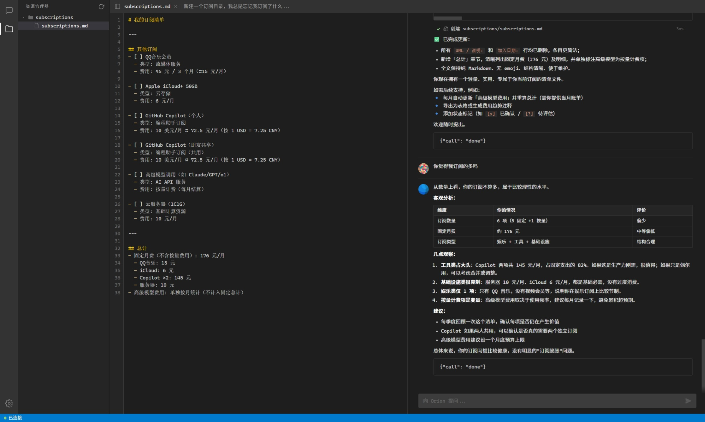
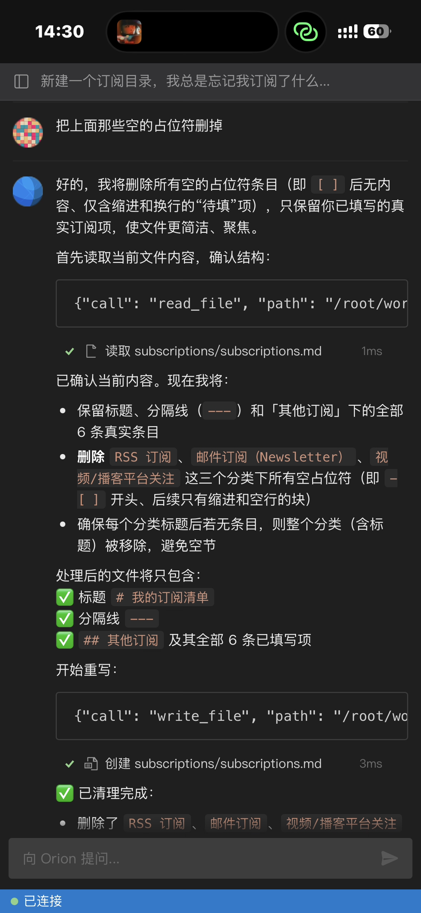
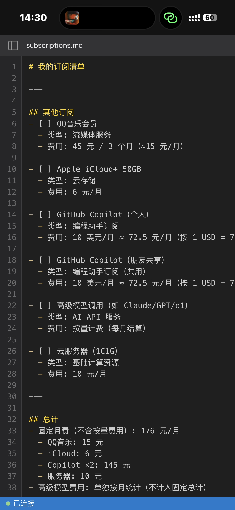
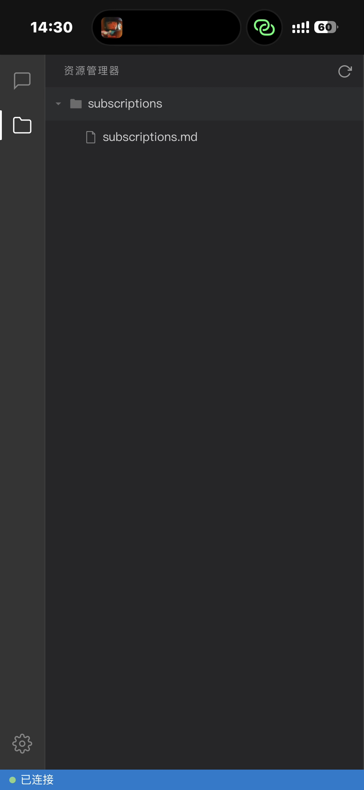

# Orion

<div align="center">

<h3>🌌 Your AI Life Assistant — Files Are Its Memory</h3>

**An AI that doesn't just talk — it reads, writes, organizes, and remembers. Self-hosted, model-free, powered by any LLM.**

[](https://python.org)
[](LICENSE)
[]()
[](https://vuejs.org)
[](https://fastapi.tiangolo.com)

[**中文文档**](README_CN.md)

</div>

---

## ✨ What is Orion?

Most AI assistants (ChatGPT, Kimi, Claude) only talk to you. You ask a question, get an answer, and the conversation eventually disappears. They can't touch your files, can't organize your notes, can't actually *do* things.

**Orion is different.** It's an AI that can act — it reads your files, writes new ones, searches content, runs scripts, and loops until the job is done. And because everything is stored as plain files on your own machine, **files become its permanent memory**. Nothing is forgotten, nothing is locked in someone else's cloud.

Tell it: *"Create a subscription tracker and add my current subscriptions"* — it creates the file, fills in the data, and next month when you ask *"How much am I spending?"*, it reads the file and gives you the answer.

- **Files = Memory** — every conversation result is a real file you own. No black-box "memory" feature that may or may not work
- **Acts, not just talks** — 27 built-in tools: read, write, search, move, run scripts, manage processes, fetch web pages
- **Any model, your choice** — Qwen, DeepSeek, Kimi, GPT, Claude — any OpenAI-compatible API
- **Self-hosted** — runs on your machine or server. Your data never leaves

## 💡 Why Orion over ChatGPT / Kimi / Claude?

<div align="center">

| | ChatGPT / Kimi / Claude | **Orion** |
|---|---|---|
| **Memory** | Chat fades away. "Memory" is a black box | **Files are memory** — Markdown, JSON, anything. Permanent, searchable, yours |
| **Can it act?** | Can only *suggest* things | **Actually does it** — reads files, writes files, runs commands, iterates |
| **Your data** | Stored on their servers | **Stays on your machine** — fully self-hosted |
| **Model lock-in** | Tied to one provider | **Any model** — swap freely, use the cheapest one |
| **Cost** | $20/month (ChatGPT Plus) | **Near-free** — Qwen Flash has generous free tier |
| **Open source** | ❌ | ✅ **MIT License** |

</div>

## 📦 Use Cases

- **📋 Subscription & expense tracking** — AI creates and maintains your financial files, analyzes spending
- **📝 Note & knowledge management** — organize Markdown notes, generate summaries, build indexes
- **📊 Data analysis** — parse CSV/JSON files, run Python scripts, generate reports
- **🗂️ File organization** — batch rename, sort, clean up — describe what you want in natural language
- **💻 Coding assistance** — read code, refactor, write tests, debug — it's a full coding agent too
- **📅 Life planning** — track goals, journal, create checklists — all persisted as files

## 📷 Screenshots

<div align="center">


<p><b>Desktop — File Browser + File Viewer + AI Chat</b></p>

<table>
<tr>
<td></td>
<td></td>
<td></td>
</tr>
<tr>
<td align="center"><b>AI Chat</b></td>
<td align="center"><b>File Viewer</b></td>
<td align="center"><b>File Browser</b></td>
</tr>
</table>

</div>

## ⚙️ How It Works

Orion uses a **SELECT → PARAMS → EXEC** tool loop: the AI picks a tool, fills in parameters, executes it, sees the result, and decides what to do next — repeating until the task is complete. This two-phase approach saves **60-80% tokens** compared to injecting full tool schemas.

```
You: "Organize my notes by topic"
 ↓
[SELECT] AI chooses: list_directory
[EXEC]   → sees 47 markdown files
[SELECT] AI chooses: read_file (reads each one)
[EXEC]   → understands content
[SELECT] AI chooses: create_directory, move_file
[EXEC]   → creates folders, moves files
[SELECT] AI chooses: done
 ↓
AI: "Done. Organized 47 notes into 6 topic folders."
```

<details>
<summary><b>Architecture</b></summary>

```
┌─────────────────────────────────────────┐
│  Web UI                                 │
│  Vue 3 · WebSocket · Markdown · Hljs    │
├─────────────────────────────────────────┤
│  FastAPI Server                         │
│  Auth · WebSocket · Static · FS Watch   │
├─────────────────────────────────────────┤
│  Orion Engine                           │
│  SELECT → PARAMS → EXEC tool loop      │
│  Streaming · Cancel · Context FIFO      │
├──────────────────┬──────────────────────┤
│  LLM Client      │  MCP Client (TCP)   │
│  OpenAI-compat   │  JSON-RPC 2.0       │
│  Model fallback  │                     │
└──────────────────┴──────────────────────┤
                   │  Axon MCP Server     │
                   │  (Git Submodule)     │
                   └──────────────────────┘
```

</details>

### Key Features

| | |
|---|---|
| 🧠 **Two-Phase Tool Calling** | SELECT → PARAMS → EXEC — saves 60-80% tokens vs. full schema injection |
| 📉 **Auto Model Fallback** | Model chain (e.g. flash → turbo → plus), auto-switches on failure |
| 🔄 **Streaming Responses** | Real-time output with smart JSON/text detection |
| 💬 **Multi-Session Chat** | Multiple conversations with full persistent history |
| 📁 **Workspace Browser** | Built-in file explorer with real-time filesystem monitoring |
| 🔐 **Auth & Security** | JWT + bcrypt auth, path boundary enforcement, dangerous command blocking |
| 🎨 **Responsive UI** | Dark IDE-style interface, works on desktop and mobile |

## 🚀 Quick Start

### Prerequisites

- Python 3.10+
- Git (for submodule)

### 1. Clone with submodule

```bash
git clone --recurse-submodules https://github.com/Micro-Mood/Orion.git
cd Orion
```

If you already cloned without `--recurse-submodules`:

```bash
git submodule update --init
```

### 2. Install dependencies

```bash
pip install -r requirements.txt
pip install -r axon/requirements.txt  # Axon dependencies
```

### 3. Configure

```bash
cp config.example.json config.json
```

Edit `config.json` — at minimum, set your LLM API key:

```json
{
    "llm": {
        "api_key": "sk-your-api-key",
        "base_url": "https://dashscope.aliyuncs.com/compatible-mode/v1",
        "models": ["qwen-flash", "qwen-turbo", "qwen-plus"]
    }
}
```

Or use environment variables:

```bash
export ORION_API_KEY="sk-your-api-key"
export ORION_API_URL="https://api.openai.com/v1"  # or any compatible endpoint
```

### 4. Run

```bash
cd src
python main.py
```

Open `http://127.0.0.1:8080` in your browser. On first visit, you'll set a login password.

## ⚙️ Configuration

Configuration is loaded with priority: **Environment Variables > config.json > Defaults**

### config.json

| Section | Field | Default | Description |
|---------|-------|---------|-------------|
| `llm` | `api_key` | `""` | LLM API key |
| `llm` | `base_url` | `https://dashscope.aliyuncs.com/compatible-mode/v1` | OpenAI-compatible endpoint |
| `llm` | `models` | `["qwen-flash", "qwen-turbo", "qwen-plus"]` | Model list (FIFO fallback order) |
| `llm` | `temperature` | `0.7` | Sampling temperature |
| `llm` | `timeout` | `120` | Request timeout (seconds) |
| `axon` | `host` | `127.0.0.1` | Axon MCP Server host |
| `axon` | `port` | `9100` | Axon MCP Server port |
| `axon` | `workspace` | `""` | Working directory for Axon (defaults to engine's) |
| `engine` | `max_history` | `20` | Max context messages (FIFO sliding window) |
| `engine` | `max_iterations` | `30` | Max tool-call iterations per message |
| `engine` | `read_file_max_lines` | `200` | Default max lines when reading files (prevents large files flooding context) |
| `engine` | `working_directory` | `""` | Working directory (defaults to `workspace/`) |
| `server` | `host` | `127.0.0.1` | Server bind address |
| `server` | `port` | `8080` | Server port |

### Environment Variables

| Variable | Maps to |
|----------|---------|
| `ORION_API_KEY` | `llm.api_key` |
| `ORION_API_URL` | `llm.base_url` |
| `ORION_TEMPERATURE` | `llm.temperature` |
| `ORION_AXON_HOST` | `axon.host` |
| `ORION_AXON_PORT` | `axon.port` |
| `ORION_AXON_WORKSPACE` | `axon.workspace` |
| `ORION_MAX_HISTORY` | `engine.max_history` |
| `ORION_MAX_ITERATIONS` | `engine.max_iterations` |
| `ORION_WORKING_DIR` | `engine.working_directory` |
| `ORION_HOST` | `server.host` |
| `ORION_PORT` | `server.port` |

## 🛠️ 27 Built-in Tools

Provided by [Axon MCP Server](https://github.com/Micro-Mood/Axon):

| Category | Tools |
|----------|-------|
| **File Operations** (12) | `read_file` · `write_file` · `delete_file` · `copy_file` · `move_file` · `create_directory` · `delete_directory` · `move_directory` · `list_directory` · `stat_path` · `replace_string_in_file` · `multi_replace_string_in_file` |
| **Command Execution** (10) | `run_command` · `create_task` · `stop_task` · `del_task` · `task_status` · `list_tasks` · `read_stdout` · `read_stderr` · `write_stdin` · `wait_task` |
| **Search** (3) | `find_files` · `search_text` · `find_symbol` |
| **System** (1) | `get_system_info` |
| **Web** (1) | `fetch_webpage` |

## 📁 Project Structure

```
Orion/
├── config.example.json     # Configuration template
├── requirements.txt        # Python dependencies
├── axon/                   # Axon MCP Server (git submodule)
├── src/
│   ├── main.py             # Entry point — starts Axon + Uvicorn
│   ├── server.py           # FastAPI + WebSocket server
│   ├── engine.py           # AI engine (SELECT → PARAMS → EXEC loop)
│   ├── llm.py              # LLM client (OpenAI-compatible, model fallback)
│   ├── mcp_client.py       # MCP TCP client (JSON-RPC 2.0)
│   ├── axon_manager.py     # Axon subprocess lifecycle management
│   ├── config.py           # Configuration management (singleton)
│   ├── context.py          # Conversation context (FIFO sliding window)
│   ├── prompt.py           # System prompt builder
│   ├── store.py            # Session & message persistence (JSON files)
│   ├── tools.py            # Tool registry (27 tools + control commands)
│   ├── prompts/
│   │   └── system.md       # System prompt template
│   └── web/                # Frontend (Vue 3 SPA)
│       ├── index.html
│       ├── app.js
│       └── style.css
├── data/                   # Runtime data (auto-created, gitignored)
│   ├── sessions.json
│   └── messages/
├── workspace/              # Default working directory (gitignored)
└── docs/                   # Documentation
```

## 🌐 Deployment

Orion can be deployed behind a reverse proxy for remote access. The frontend auto-detects its base path, so it works at any URL prefix (e.g. `https://example.com/orion/`).

```bash
# Bind to all interfaces
export ORION_HOST="0.0.0.0"
cd src && python main.py
```

For production, use a reverse proxy (Nginx/Caddy) with HTTPS and WebSocket support. See [docs/getting-started.md](docs/getting-started.md#remote-access) for details.

## 🔒 Security

- **Password authentication** — bcrypt-hashed passwords, JWT tokens
- **Path boundary enforcement** — Axon restricts file operations to the workspace
- **Dangerous command blocking** — 50+ patterns blocked by Axon middleware
- **No sensitive data in repo** — API keys, passwords, and JWT secrets are in `config.json` (gitignored)

## 🤝 Contributing

Contributions are welcome! Please feel free to submit issues and pull requests.

## 📄 License

[MIT](LICENSE)
