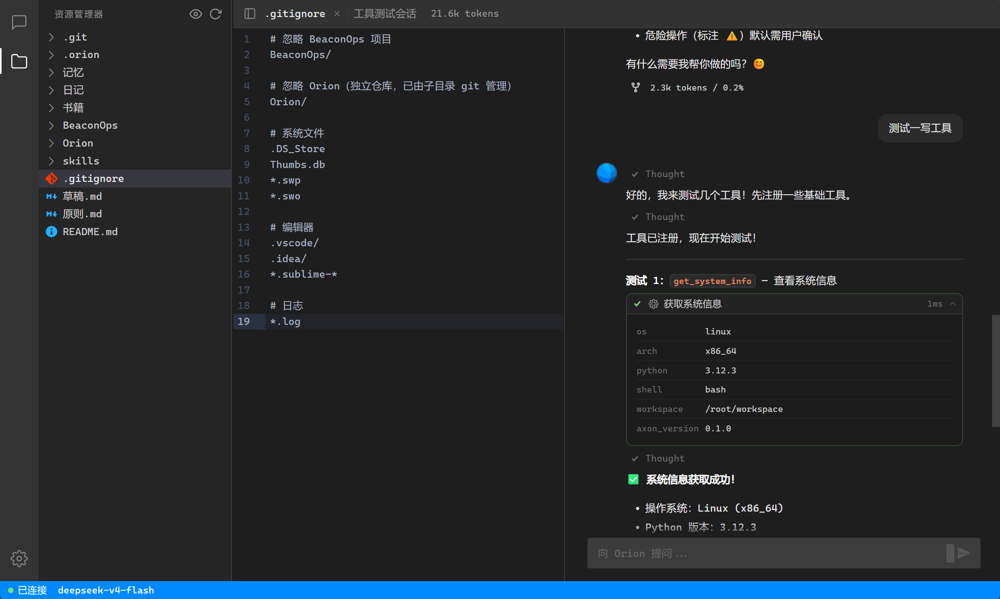
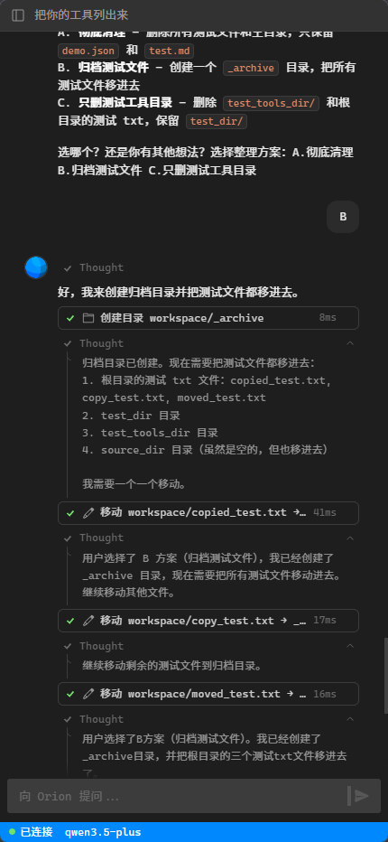
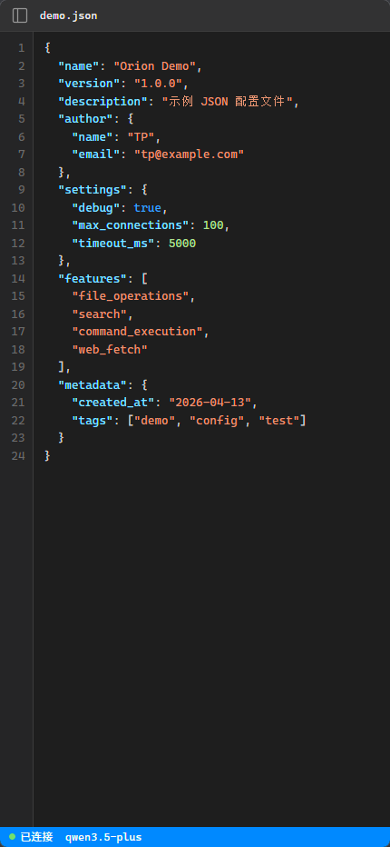
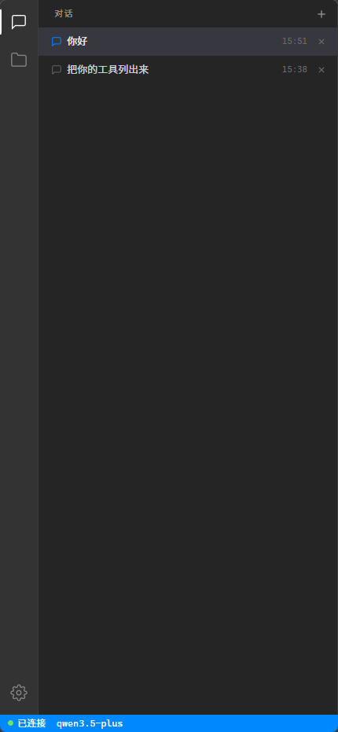
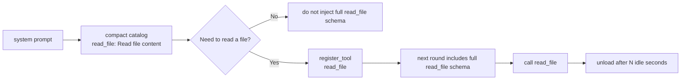
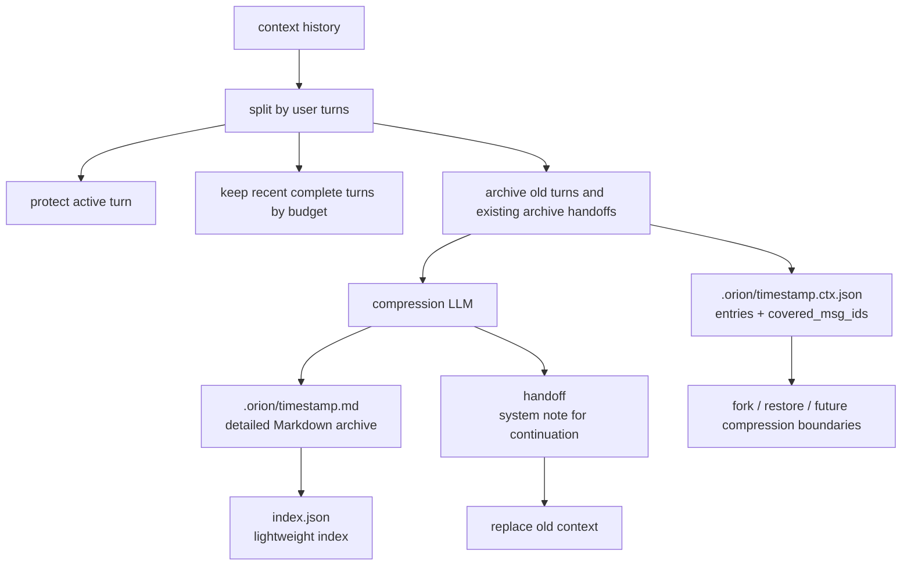

# Orion

<div align="center">

<h3>Self-hosted AI Agent: On-demand Tools, File Memory, and Traceable Context</h3>

**Put tool registration, long-term memory, context compression, session fork, and local integrations such as Notion into a workflow you can inspect.**

[](https://python.org)
[](LICENSE)
[]()
[](https://vuejs.org)
[](https://fastapi.tiangolo.com)

[**中文文档**](README_CN.md)

</div>

---

## Screenshots

<div align="center">


<p><b>Desktop: file browser + code editor + AI chat</b></p>

<table>
<tr>
<td></td>
<td></td>
<td></td>
</tr>
<tr>
<td align="center"><b>AI Chat</b></td>
<td align="center"><b>Code Editor</b></td>
<td align="center"><b>File Browser</b></td>
</tr>
</table>

</div>

---

## Why Orion?

Many agents can already call tools. Orion focuses on the engineering problems that appear when tool-using agents become part of long-running personal workflows: runtime cost, context management, local memory, and traceability.

In practice, tool-using agents often hit a few recurring issues:

- As the tool set grows, full JSON Schemas keep occupying context even when the current turn does not need those tools.
- Long conversations keep expanding context. If old history is only truncated, early decisions and unfinished work can disappear.
- If memory only lives in a service database, it is harder for the user to inspect, migrate, audit, or correct.
- When forking from the middle of a conversation, the system must know which context belongs before the fork and which context belongs to later branches.

Orion is designed to make an agent's tools, memory, context, and forks maintainable as a local system.

---

## Design Highlights

### 1. Tool Calling: Native `tool_calls` + On-demand `register_tool`

Regular function calling puts each tool's full definition into model context: name, description, parameter names, parameter types, parameter descriptions, defaults, and required fields. A single `read_file` schema already looks like this:

```json
{
  "type": "function",
  "function": {
    "name": "read_file",
    "description": "Read file content",
    "parameters": {
      "type": "object",
      "properties": {
        "path": {
          "type": "string",
          "description": "File path"
        },
        "encoding": {
          "type": "string",
          "description": "Encoding",
          "default": "utf-8"
        },
        "line_range": {
          "type": "array",
          "description": "Line range [start, end]"
        },
        "max_size": {
          "type": "integer",
          "description": "Max bytes"
        }
      },
      "required": ["path"]
    }
  }
}
```

Orion first keeps only compact catalog lines in the system prompt:

```text
read_file: Read file content
```

When the model needs a tool, it calls the always-available `register_tool`. The full schema becomes callable in the next LLM round:


```mermaid
flowchart LR
    A[system prompt] --> B[compact catalog<br/>read_file: Read file content]
    B --> C{Need to read a file?}
    C -- No --> D[do not inject full read_file schema]
    C -- Yes --> E[register_tool<br/>read_file]
    E --> F[next round includes full read_file schema]
    F --> G[call read_file]
    G --> H[unload after N idle seconds]
```

This means:

- Unused tools do not occupy full-schema tokens.
- The model can only call tools that have been registered for the session.
- Registered tools persist with the session, so page refresh and reconnect can recover them.
- TTL unloads idle tools to keep long conversations from accumulating schemas forever.

Tool execution still uses the native OpenAI-compatible `tool_calls` protocol. The model emits tool calls, Orion executes them, returns tool messages to the model, and continues until the model produces final text.

```text
user input
  -> LLM streams text or tool_calls
  -> Orion executes tools and persists results
  -> tool results return to the LLM
  -> loop until completion
```

Dangerous tools require confirmation by default. The user can cancel a running task. Assistant messages, tool calls, tool results, and system notes are persisted into the AI context, so interrupted sessions can continue with the same state.

### 2. Long-term Memory And Context Compression: Archive + Handoff + Sidecar

If long conversations only rely on a sliding window, early decisions, preferences, and unfinished work may be truncated. Orion's compression flow does not simply delete old messages. It turns old context into three outputs: a human-readable archive, an LLM handoff, and a machine-readable sidecar.


```mermaid
flowchart TD
    A[context history] --> B[split by user turns]
    B --> C[protect active turn]
    B --> D[keep recent complete turns by budget]
    B --> E[archive old turns and existing archive handoffs]
    E --> F[compression LLM]
    F --> G[.orion/timestamp.md<br/>detailed Markdown archive]
    F --> H[handoff<br/>system note for continuation]
    E --> I[.orion/timestamp.ctx.json<br/>entries + covered_msg_ids]
    G --> J[index.json<br/>lightweight index]
    H --> K[replace old context]
    I --> L[fork / restore / future compression boundaries]
```

Archives are ordinary files:

```text
.orion/
├── index.json
├── 20260519-151815.md
└── 20260519-151815.ctx.json
```

- `.md` is the detailed Markdown archive: conversation flow, key facts, constraints, user wording, current state, and follow-up items.
- `handoff` is kept in the current context as a `[已压缩历史交接]` system note, so the model can continue without reading the full archive every round.
- `.ctx.json` stores sidecar data: original `entries`, `covered_msg_ids`, `covered_turn_ids`, archived count, and token estimate.
- `index.json` enters the system prompt as a lightweight memory index. When early details are needed, the model can register `read_file` and read the corresponding `.md` archive.

Compression chooses complete turns. The active user turn is protected, recent complete turns are kept within budget, and older complete turns become the archive scope. This reduces the chance of cutting through an unfinished tool sequence.

Orion does not put long-term memory into a vector database by default. Vector retrieval can be added as an extra capability, but the base memory layer stays in the filesystem so it can be inspected, backed up, moved, and corrected.

### 3. Fork: Rebuild Context At Message Boundaries

Real workflows often branch from a previous message: try another implementation, start a research direction, or return to an earlier decision point.

If old history has already been compressed into `.orion/*.md`, a fork must know which archives belong before the target message and which belong to later conversation branches.

Orion's fork logic rebuilds context using message IDs, turn IDs, archive sidecars, and `covered_msg_ids`:

- Context before the target message is kept.
- Archives fully inside the target range are inherited.
- Partially overlapping archives are restored from sidecar entries recursively.
- Context after the target message is not carried into the new branch.

The result is a fork whose context boundary can be inspected, not just a copied frontend chat transcript.

## What Can It Be Used For?

Orion is not limited to coding. It fits personal workflows that need long-term records, file operations, and automatic execution.

- Note organization: read scattered files, categorize them, rename them, and generate indexes.
- Reading and research: save discussion outcomes as Markdown, then continue later.
- Personal assistant workflows: maintain TODOs, bills, subscriptions, plans, and reviews.
- Programming: read code, edit files, run commands, inspect logs, and iterate on fixes.
- Data processing: analyze CSV/JSON, run scripts, and generate reports.
- Long-running projects: preserve decisions, constraints, and open items in `.orion` archives.

Results land in your filesystem, so you can inspect, move, back up, or reuse them directly.

---

## Quick Start

### Requirements

- Python 3.10+
- Git

### 1. Clone

```bash
git clone https://github.com/Micro-Mood/Orion.git
cd Orion
```

Axon is included under `axon/` via git subtree and is available after a normal clone.

### 2. Install Dependencies

```bash
pip install -r requirements.txt
pip install -r axon/requirements.txt
```

### 3. Configure

```bash
cp config.example.json config.json
```

Edit `config.json` and set your API key:

```json
{
    "llm": {
        "api_key": "sk-your-api-key",
        "base_url": "https://dashscope.aliyuncs.com/compatible-mode/v1",
        "models": ["qwen-flash", "qwen-turbo", "qwen-plus"]
    }
}
```

You can also use an environment variable:

```bash
export ORION_API_KEY="sk-your-api-key"
```

If you want to use Notion tools, add an integration key to `config.json`:

```json
{
  "integrations": {
    "notion_api_key": "ntn_your_notion_key"
  }
}
```

You can also fill it later in Settings -> Integrations. Orion injects the key server-side, so it does not appear in model-visible tool schemas or chat-visible tool params.

### 4. Run

```bash
cd src
python main.py
```

Open `http://127.0.0.1:8080`, set a password, and start using Orion.

---

## Deploy To A Server

For phone or external access, deploy Orion to a small server:

```bash
git clone https://github.com/Micro-Mood/Orion.git
cd Orion
pip install -r requirements.txt
pip install -r axon/requirements.txt
cp config.example.json config.json
# Edit config.json and set your API key

export ORION_HOST="0.0.0.0"
cd src && python main.py
```

Use Nginx or another reverse proxy with HTTPS for public access.

> The frontend auto-detects the base path, so deployments such as `https://your-domain.com/orion/` are supported.

See [docs/getting-started.md](docs/getting-started.md#remote-access) for detailed deployment guidance.

---

## Configuration Reference

Priority: **environment variables > config.json > defaults**

<details>
<summary><b>config.json fields</b></summary>

| Section | Field | Default | Description |
|---------|-------|---------|-------------|
| `llm` | `api_key` | `""` | LLM API key |
| `llm` | `base_url` | `https://dashscope.aliyuncs.com/compatible-mode/v1` | OpenAI-compatible endpoint |
| `llm` | `models` | `["qwen-flash", "qwen-turbo", "qwen-plus"]` | Model fallback list |
| `llm` | `temperature` | `0.7` | Sampling temperature |
| `llm` | `timeout` | `120` | Request timeout in seconds |
| `llm` | `max_retries` | `3` | Max retries per model |
| `axon` | `host` | `127.0.0.1` | Axon MCP Server host |
| `axon` | `port` | `9100` | Axon MCP Server port |
| `axon` | `connect_timeout` | `5.0` | Axon connection timeout in seconds |
| `axon` | `call_timeout` | `60.0` | Tool call timeout in seconds |
| `axon` | `auto_start` | `true` | Whether to start Axon as a subprocess |
| `axon` | `workspace` | `""` | Axon workspace |
| `engine` | `max_iterations` | `30` | Max tool loop iterations per message |
| `engine` | `working_directory` | `""` | Orion working directory; empty falls back to `axon.workspace`, then `workspace/` |
| `engine` | `stream_chunk_size` | `4` | Characters per streaming text chunk |
| `engine` | `stream_chunk_delay` | `0.02` | Delay between streaming chunks in seconds |
| `engine` | `read_file_max_lines` | `200` | Default file-read line budget |
| `engine` | `auto_confirm_dangerous` | `false` | Whether to auto-confirm dangerous tools |
| `engine` | `tool_ttl_seconds` | `300` | Unload registered tools after N idle seconds; `0` disables TTL |
| `engine` | `context_window` | `128000` | Estimated model context window |
| `engine` | `compress_at` | `0.55` | Compress when context usage reaches this ratio; lower values reduce uncached input cost; `0` disables compression |
| `engine` | `context_recent_n` | `4` | Max recent complete turns kept outside archives |
| `engine` | `memory_dir` | `.orion` | Long-term memory directory relative to the working directory |
| `server` | `host` | `127.0.0.1` | Server bind address |
| `server` | `port` | `8080` | Server port |
| `auth` | `token_expiry_hours` | `72` | Login token validity in hours |
| `integrations` | `notion_api_key` | `""` | Notion API key used for `notion_*` tools; stored locally and injected server-side |

</details>

<details>
<summary><b>Environment variables</b></summary>

| Variable | Maps to |
|----------|---------|
| `ORION_API_KEY` | `llm.api_key` |
| `ORION_API_URL` | `llm.base_url` |
| `ORION_TEMPERATURE` | `llm.temperature` |
| `ORION_AXON_HOST` | `axon.host` |
| `ORION_AXON_PORT` | `axon.port` |
| `ORION_AXON_WORKSPACE` | `axon.workspace` |
| `ORION_MAX_ITERATIONS` | `engine.max_iterations` |
| `ORION_WORKING_DIR` | `engine.working_directory` |
| `ORION_TOOL_TTL_SECONDS` | `engine.tool_ttl_seconds` |
| `ORION_CONTEXT_WINDOW` | `engine.context_window` |
| `ORION_COMPRESS_AT` | `engine.compress_at` |
| `ORION_CONTEXT_RECENT_N` | `engine.context_recent_n` |
| `ORION_HOST` | `server.host` |
| `ORION_PORT` | `server.port` |

</details>

`notion_api_key` currently has no environment variable mapping. Configure it through `config.json` or the Settings -> Integrations page so Orion can inject it server-side.

---

## Built-in Tools

Provided by [Axon MCP Server](https://github.com/Micro-Mood/Axon):

| Category | Tools |
|----------|-------|
| Files (12) | `read_file` · `write_file` · `delete_file` · `copy_file` · `move_file` · `create_directory` · `delete_directory` · `move_directory` · `list_directory` · `stat_path` · `replace_string_in_file` · `multi_replace_string_in_file` |
| Commands (10) | `run_command` · `create_task` · `stop_task` · `del_task` · `task_status` · `list_tasks` · `read_stdout` · `read_stderr` · `write_stdin` · `wait_task` |
| Search (3) | `find_files` · `search_text` · `find_symbol` |
| System (1) | `get_system_info` |
| Web (1) | `fetch_webpage` |
| Notion (15) | `notion_search` · `notion_get_page` · `notion_get_block_children` · `notion_query_database` · `notion_get_comments` · `notion_list_users` · `notion_create_page` · `notion_update_page` · `notion_archive_page` · `notion_append_blocks` · `notion_update_block` · `notion_delete_block` · `notion_create_database` · `notion_update_database` · `notion_create_comment` |

---

## Project Structure

```text
Orion/
├── config.example.json
├── requirements.txt
├── axon/                   # Axon MCP Server, included with this repository
├── src/
│   ├── main.py             # Entry point
│   ├── server.py           # FastAPI + WebSocket
│   ├── engine.py           # Tool loop, memory compression, fork
│   ├── memory.py           # .orion archive and index
│   ├── llm.py              # OpenAI-compatible LLM client
│   ├── mcp_client.py       # MCP TCP client
│   ├── axon_manager.py     # Axon subprocess manager
│   ├── config.py           # Configuration manager
│   ├── context.py          # Conversation context and tool registry state
│   ├── prompt.py           # System prompt renderer
│   ├── store.py            # Session, message, and context persistence
│   ├── tools.py            # Tool catalog and schemas
│   ├── prompts/
│   │   └── system.md       # System prompt template
│   └── web/                # Vue 3 frontend
├── data/                   # Runtime data, gitignored
├── workspace/              # Default working directory, gitignored
└── docs/
```

---

## Security

- Password authentication: bcrypt + JWT.
- Path sandboxing: file operations are restricted to the workspace.
- Dangerous command blocking: common high-risk command patterns are blocked.
- Dangerous tool confirmation: writes, deletes, command execution, and similar operations require confirmation by default.
- Sensitive data isolation: LLM and Notion API keys live in local config. Notion credentials are injected server-side and sanitized before UI display or persistence.

---

## License

[MIT](LICENSE)