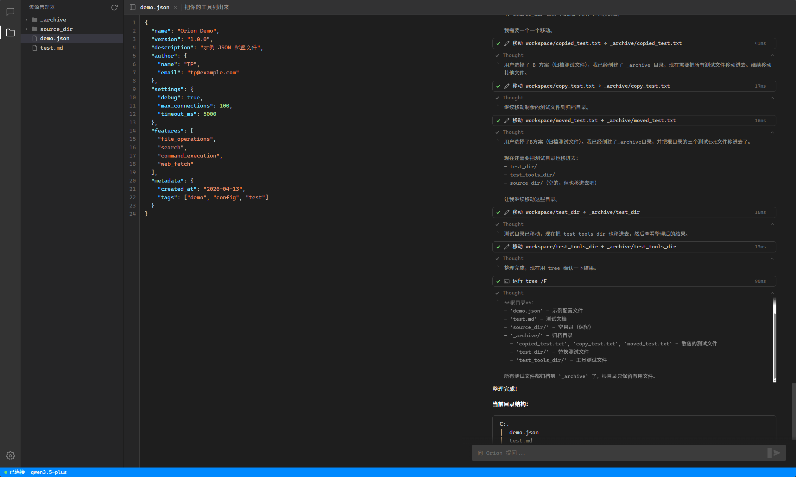
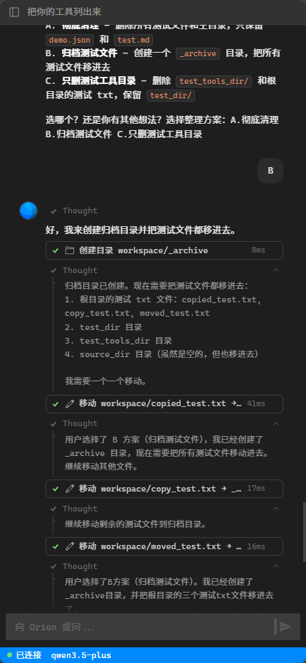
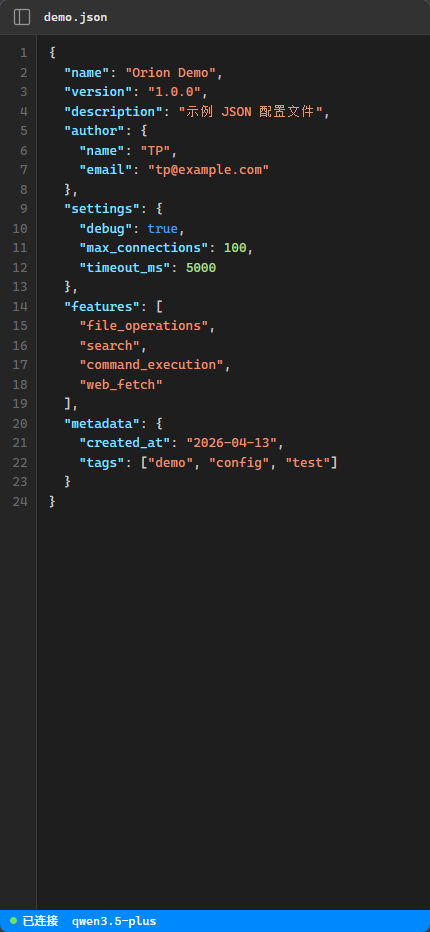
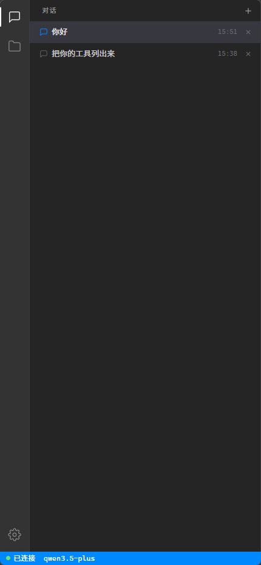

# Orion

<div align="center">

<h3>🌌 你的 AI 生活助理 — 文件就是它的记忆</h3>

**一个不只会聊天的 AI —— 它能读、写、整理、记住。自托管，模型自由，接入任意大模型。**

[](https://python.org)
[](LICENSE)
[]()
[](https://vuejs.org)
[](https://fastapi.tiangolo.com)

[**English**](README.md)

</div>

---

## ✨ Orion 是什么？

大多数 AI 助手（ChatGPT、Kimi、Claude）只能跟你聊天。你问一个问题，得到答案，对话最终消失。它们碰不到你的文件，整理不了你的笔记，做不了实际的事。

**Orion 不一样。** 它是一个能动手的 AI——读你的文件、创建新文件、搜索内容、跑脚本，循环执行直到任务完成。而且因为所有东西都以普通文件的形式存在你自己的机器上，**文件就是它的永久记忆**。不会遗忘，不会锁在别人的云端。

告诉它：*"建一个订阅清单，把我现在的订阅都加进去"*——它创建文件、填好数据。下个月你问*"我每个月花多少钱？"*，它读取文件、给你答案。

- **文件 = 记忆** — 每次对话的成果都是你拥有的真实文件，不是什么不知道靠不靠谱的"记忆"功能
- **能动手，不只会说** — 27 个内置工具：读、写、搜索、移动、运行脚本、管理进程、抓取网页
- **模型随便选** — 通义千问、DeepSeek、Kimi、GPT、Claude——任意 OpenAI 兼容 API
- **自托管** — 运行在你自己的电脑或服务器上，数据不出门

## 💡 比 ChatGPT / Kimi / Claude 好在哪？

<div align="center">

| | ChatGPT / Kimi / Claude | **Orion** |
|---|---|---|
| **记忆** | 聊完就忘，"记忆"功能是个黑盒 | **文件就是记忆**——Markdown、JSON，永久、可搜索、属于你 |
| **能不能动手？** | 只能*建议*你怎么做 | **直接做**——读文件、写文件、跑命令、自主循环 |
| **数据归属** | 存在别人的服务器上 | **在你自己的机器上**——完全自托管 |
| **模型绑定** | 锁定一个厂商 | **随便换**——哪个便宜用哪个 |
| **费用** | ¥140/月（ChatGPT Plus） | **几乎免费**——通义千问 Flash 免费额度够日常用 |
| **开源** | ❌ | ✅ **MIT 协议** |

</div>

## 📦 使用场景

- **📋 订阅 / 支出管理** — AI 创建并维护你的财务文件，分析消费
- **📝 笔记 / 知识管理** — 整理 Markdown 笔记，生成摘要，建索引
- **📊 数据分析** — 解析 CSV/JSON 文件，跑 Python 脚本，生成报表
- **🗂️ 文件整理** — 批量重命名、分类、清理——用自然语言描述就行
- **💻 编程辅助** — 读代码、重构、写测试、调试——它同时也是完整的编程智能体
- **📅 生活规划** — 记日记、追踪目标、建清单——全部持久化为文件

## 📷 截图

<div align="center">


<p><b>桌面端 — 文件浏览器 + 代码编辑器 + AI 对话</b></p>

<table>
<tr>
<td></td>
<td></td>
<td></td>
</tr>
<tr>
<td align="center"><b>AI 对话</b></td>
<td align="center"><b>代码编辑器</b></td>
<td align="center"><b>文件浏览器</b></td>
</tr>
</table>

</div>

## ⚙️ 工作原理

Orion 使用 **SELECT → PARAMS → EXEC** 工具循环：AI 选择工具、填参数、执行、看结果、决定下一步——循环直到任务完成。这种两阶段调用方式比传统的全量 Schema 注入**省 60-80% token**。

```
你: "按主题整理我的笔记"
 ↓
[SELECT] AI 选择: list_directory
[EXEC]   → 看到 47 个 Markdown 文件
[SELECT] AI 选择: read_file（逐个读取）
[EXEC]   → 理解内容
[SELECT] AI 选择: create_directory, move_file
[EXEC]   → 建文件夹、移动文件
[SELECT] AI 选择: done
 ↓
AI: "完成。47 篇笔记已按 6 个主题分类整理。"
```

<details>
<summary><b>架构</b></summary>

```
┌─────────────────────────────────────────┐
│  Web 界面                               │
│  Vue 3 · WebSocket · Markdown · CM6     │
├─────────────────────────────────────────┤
│  FastAPI 服务端                          │
│  认证 · WebSocket · 静态文件 · 文件监控  │
├─────────────────────────────────────────┤
│  Orion 引擎                             │
│  SELECT → PARAMS → EXEC 工具循环        │
│  流式输出 · 取消 · 上下文 FIFO           │
├──────────────────┬──────────────────────┤
│  LLM 客户端      │  MCP 客户端 (TCP)    │
│  OpenAI 兼容     │  JSON-RPC 2.0       │
│  模型降级        │                      │
└──────────────────┴──────────────────────┤
                   │  Axon MCP Server     │
                   │  (Git 子模块)         │
                   └──────────────────────┘
```

</details>

### 核心特性

| | |
|---|---|
| 🧠 **两阶段工具调用** | SELECT → PARAMS → EXEC，比全量 Schema 注入省 60-80% token |
| 📉 **自动模型降级** | 模型链（如 flash → turbo → plus），失败自动切换 |
| 🔄 **流式响应** | 实时输出，智能 JSON/文本检测 |
| 💬 **多会话对话** | 多个对话并行，完整历史持久化 |
| 📁 **工作区浏览器** | 内置文件浏览器，实时文件系统监控 |
| � **代码编辑器** | 基于 CodeMirror 6，支持 13+ 种语言语法高亮 |
| 💭 **思考过程展示** | 实时展示 AI 推理过程（支持该功能的模型） |
| �🔐 **认证与安全** | JWT + bcrypt 认证，路径边界限制，危险命令拦截 |
| 🎨 **响应式界面** | 暗色 IDE 风格，桌面端 + 移动端均可用 |

## 🚀 快速开始

### 环境要求

- Python 3.10+
- Git（用于子模块）

### 1. 克隆项目（含子模块）

```bash
git clone --recurse-submodules https://github.com/Micro-Mood/Orion.git
cd Orion
```

如果已经克隆但未拉取子模块：

```bash
git submodule update --init
```

### 2. 安装依赖

```bash
pip install -r requirements.txt
pip install -r axon/requirements.txt  # Axon 子模块依赖
```

### 3. 配置

```bash
cp config.example.json config.json
```

编辑 `config.json`，至少设置 LLM API Key：

```json
{
    "llm": {
        "api_key": "sk-your-api-key",
        "base_url": "https://dashscope.aliyuncs.com/compatible-mode/v1",
        "models": ["qwen-flash", "qwen-turbo", "qwen-plus"]
    }
}
```

也可以使用环境变量：

```bash
export ORION_API_KEY="sk-your-api-key"
export ORION_API_URL="https://api.openai.com/v1"  # 或其他兼容端点
```

### 4. 启动

```bash
cd src
python main.py
```

浏览器打开 `http://127.0.0.1:8080`，首次访问会要求设置登录密码。

## ⚙️ 配置

配置加载优先级：**环境变量 > config.json > 默认值**

### config.json

| 分组 | 字段 | 默认值 | 说明 |
|------|------|--------|------|
| `llm` | `api_key` | `""` | LLM API 密钥 |
| `llm` | `base_url` | `https://dashscope.aliyuncs.com/compatible-mode/v1` | OpenAI 兼容接口地址 |
| `llm` | `models` | `["qwen-flash", "qwen-turbo", "qwen-plus"]` | 模型列表（FIFO 降级顺序） |
| `llm` | `temperature` | `0.7` | 采样温度 |
| `llm` | `timeout` | `120` | 请求超时（秒） |
| `axon` | `host` | `127.0.0.1` | Axon MCP Server 地址 |
| `axon` | `port` | `9100` | Axon MCP Server 端口 |
| `axon` | `workspace` | `""` | Axon 工作目录（默认跟随引擎） |
| `engine` | `max_history` | `20` | 最大上下文消息数（FIFO 滑动窗口） |
| `engine` | `max_iterations` | `30` | 每条消息最大工具调用轮次 |
| `engine` | `read_file_max_lines` | `200` | 读取文件时默认最大行数（防止大文件刷爆上下文） |
| `engine` | `working_directory` | `""` | 工作目录（默认 `workspace/`） |
| `server` | `host` | `127.0.0.1` | 服务器绑定地址 |
| `server` | `port` | `8080` | 服务器端口 |

### 环境变量

| 变量 | 对应配置 |
|------|----------|
| `ORION_API_KEY` | `llm.api_key` |
| `ORION_API_URL` | `llm.base_url` |
| `ORION_TEMPERATURE` | `llm.temperature` |
| `ORION_AXON_HOST` | `axon.host` |
| `ORION_AXON_PORT` | `axon.port` |
| `ORION_AXON_WORKSPACE` | `axon.workspace` |
| `ORION_MAX_HISTORY` | `engine.max_history` |
| `ORION_MAX_ITERATIONS` | `engine.max_iterations` |
| `ORION_WORKING_DIR` | `engine.working_directory` |
| `ORION_HOST` | `server.host` |
| `ORION_PORT` | `server.port` |

## 🛠️ 27 个内置工具

通过 [Axon MCP Server](https://github.com/Micro-Mood/Axon) 提供：

| 分类 | 工具 |
|------|------|
| **文件操作**（12） | `read_file` · `write_file` · `delete_file` · `copy_file` · `move_file` · `create_directory` · `delete_directory` · `move_directory` · `list_directory` · `stat_path` · `replace_string_in_file` · `multi_replace_string_in_file` |
| **命令执行**（10） | `run_command` · `create_task` · `stop_task` · `del_task` · `task_status` · `list_tasks` · `read_stdout` · `read_stderr` · `write_stdin` · `wait_task` |
| **搜索**（3） | `find_files` · `search_text` · `find_symbol` |
| **系统**（1） | `get_system_info` |
| **网络**（1） | `fetch_webpage` |

## 📁 项目结构

```
Orion/
├── config.example.json     # 配置模板
├── requirements.txt        # Python 依赖
├── axon/                   # Axon MCP Server（git 子模块）
├── src/
│   ├── main.py             # 入口——启动 Axon + Uvicorn
│   ├── server.py           # FastAPI + WebSocket 服务端
│   ├── engine.py           # AI 引擎（SELECT → PARAMS → EXEC 循环）
│   ├── llm.py              # LLM 客户端（OpenAI 兼容，模型降级）
│   ├── mcp_client.py       # MCP TCP 客户端（JSON-RPC 2.0）
│   ├── axon_manager.py     # Axon 子进程生命周期管理
│   ├── config.py           # 配置管理（单例模式）
│   ├── context.py          # 对话上下文（FIFO 滑动窗口）
│   ├── prompt.py           # 系统提示词构建
│   ├── store.py            # 会话与消息持久化（JSON 文件）
│   ├── tools.py            # 工具注册表（27 工具 + 控制指令）
│   ├── prompts/
│   │   └── system.md       # 系统提示词模板
│   └── web/                # 前端（Vue 3 SPA）
│       ├── index.html
│       ├── app.js
│       ├── style.css
│       ├── editor.js       # CodeMirror 6 编辑器集成
│       └── cm6-bundle.js   # CodeMirror 6 预构建包
├── data/                   # 运行时数据（自动创建，已 gitignore）
│   ├── sessions.json
│   └── messages/
├── workspace/              # 默认工作目录（已 gitignore）
└── docs/                   # 文档
```

## 🌐 部署

Orion 可以部署在反向代理后进行远程访问。前端自动检测 Base Path，因此可以在任意 URL 前缀下运行（如 `https://example.com/orion/`）。

```bash
# 绑定到所有网络接口
export ORION_HOST="0.0.0.0"
cd src && python main.py
```

生产环境建议使用 Nginx/Caddy 反向代理 + HTTPS + WebSocket 支持。参见 [docs/getting-started.md](docs/getting-started.md#remote-access)。

## 🔒 安全性

- **密码认证** — bcrypt 密码哈希 + JWT token
- **路径边界** — Axon 限制文件操作在工作区范围内
- **危险命令拦截** — Axon 中间件拦截 50+ 种危险命令模式
- **敏感数据隔离** — API 密钥、密码、JWT 密钥存放在 `config.json`（已 gitignore）

## 🤝 贡献

欢迎提交 Issue 和 Pull Request！

## 📄 许可证

[MIT](LICENSE)
