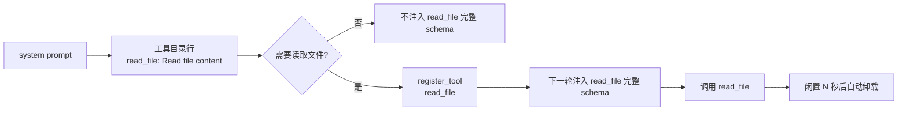
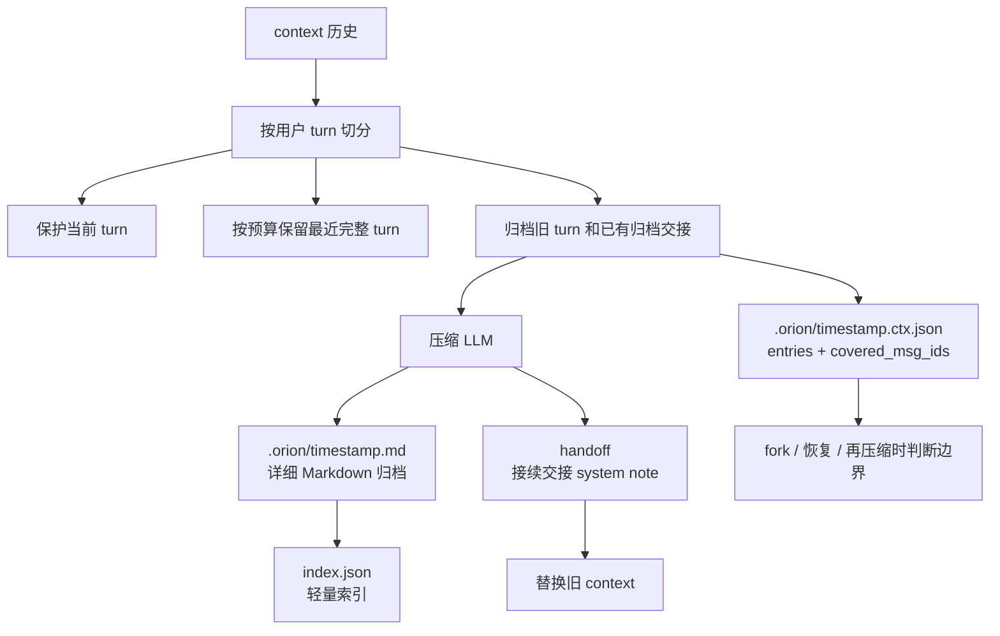

# Orion

<div align="center">

<h3>自托管 AI Agent：按需工具、文件记忆与可追溯上下文</h3>

<p>
  <a href="https://www.notion.so/product">
    
  </a>
  <br/>
  已接入 15 个 Notion 工具，支持搜索、页面、数据库、内容块与评论。
</p>

**把工具注册、长期记忆、上下文压缩、会话分叉，以及本地集成放进一套可检查的工作流里。**

[](https://python.org)
[](LICENSE)
[]()
[](https://vuejs.org)
[](https://fastapi.tiangolo.com)

<table>
<tr>
<td align="center"><strong>按需加载</strong><br/>工具 Schema</td>
<td align="center"><strong>文件记忆</strong><br/>长期可检查</td>
<td align="center"><strong>可分叉</strong><br/>会话上下文</td>
<td align="center"><strong>15</strong><br/>已接入 Notion 工具</td>
</tr>
</table>

<p>
  <a href="#screenshots">截图</a> ·
  <a href="#design-highlights">设计要点</a> ·
  <a href="#quick-start">快速开始</a> ·
  <a href="#built-in-tools">内置工具</a> ·
  <a href="#deploy">部署</a>
</p>

[**English**](README.md)

</div>

---

<a id="screenshots"></a>

## 截图

<div align="center">


<p><b>桌面端：文件浏览器 + 代码编辑器 + AI 对话</b></p>

<table>
<tr>
<td></td>
<td></td>
<td></td>
</tr>
<tr>
<td align="center"><b>AI 对话</b></td>
<td align="center"><b>代码编辑器</b></td>
<td align="center"><b>文件浏览器</b></td>
</tr>
</table>

</div>

---

## 为什么是 Orion？

许多 Agent 已经具备工具调用能力。Orion 关注的是这些能力进入长期使用后的运行成本、上下文管理和可检查性。

在实际使用中，工具调用型 Agent 常会遇到几个工程问题：

- 工具数量增加后，完整 JSON Schema 会持续占用上下文，即使本轮并不会调用这些工具。
- 长对话会不断扩大上下文；如果只依赖窗口截断，早期决策和未完成事项容易丢失。
- 记忆如果只存在服务端或数据库里，用户较难查看、迁移、审计和修正。
- 从中途 fork 新方向时，需要明确哪些上下文属于 fork 前，哪些属于后续分支。

Orion 的设计重点是把 Agent 运行时的上下文、工具、记忆和会话分叉做成一套可维护的本地系统。

---

<a id="design-highlights"></a>

## 设计要点

### 1. 工具调用：原生 tool_calls + register_tool 按需 schema

常规 Function Calling 会把工具的完整定义放进模型上下文：名称、描述、参数名、类型、参数说明、枚举值。只看一个 `read_file`，就已经是一整段 JSON Schema：

```json
{
  "type": "function",
  "function": {
    "name": "read_file",
    "description": "Read file content",
    "parameters": {
      "type": "object",
      "properties": {
        "path": {
          "type": "string",
          "description": "File path"
        },
        "encoding": {
          "type": "string",
          "description": "Encoding",
          "default": "utf-8"
        },
        "line_range": {
          "type": "array",
          "description": "Line range [start, end]"
        },
        "max_size": {
          "type": "integer",
          "description": "Max bytes"
        }
      },
      "required": ["path"]
    }
  }
}
```

Orion 在 system prompt 里先只保留工具目录行：

```text
read_file: Read file content
```

模型需要某个工具时，先调用始终可用的 `register_tool`。下一轮开始，该工具的完整 schema 才进入可调用工具列表：


```mermaid
flowchart LR
    A[system prompt] --> B[工具目录行<br/>read_file: Read file content]
    B --> C{需要读取文件?}
    C -- 否 --> D[不注入 read_file 完整 schema]
    C -- 是 --> E[register_tool<br/>read_file]
    E --> F[下一轮注入 read_file 完整 schema]
    F --> G[调用 read_file]
    G --> H[闲置 N 秒后自动卸载]
```

这样做的结果是：

- 未使用工具不占完整 schema token。
- 模型只能调用已注册工具，工具权限边界更清楚。
- 注册列表按会话持久化，刷新页面或断线重连后可以恢复。
- TTL 自动卸载闲置工具，避免长对话中的工具 schema 持续扩大。

工具执行本身仍使用 OpenAI 兼容的原生 `tool_calls` 协议：模型输出工具调用，服务端执行工具，把结果作为 tool message 返回给模型，循环直到模型输出最终文本。

```text
用户输入
  -> LLM 流式输出文本或 tool_calls
  -> Orion 执行工具并持久化结果
  -> 工具结果返回给 LLM
  -> 继续循环直到完成
```

危险工具会触发确认，用户可以取消正在运行的任务。中间的 assistant、tool、system note 都会进入持久化上下文，断线后仍能恢复。

### 2. 长期记忆与上下文压缩：归档正文 + 接续交接 + sidecar

长对话如果只靠滑动窗口，早期决策、用户偏好和未完成任务可能会被截断。Orion 的压缩流程不是直接删除旧消息，而是把旧上下文转成三类产物：给人看的归档、给下一轮模型看的交接、给程序判断边界的 sidecar。


```mermaid
flowchart TD
    A[context 历史] --> B[按用户 turn 切分]
    B --> C[保护当前 turn]
    B --> D[按预算保留最近完整 turn]
    B --> E[归档旧 turn 和已有归档交接]
    E --> F[压缩 LLM]
    F --> G[.orion/timestamp.md<br/>详细 Markdown 归档]
    F --> H[handoff<br/>接续交接 system note]
    E --> I[.orion/timestamp.ctx.json<br/>entries + covered_msg_ids]
    G --> J[index.json<br/>轻量索引]
    H --> K[替换旧 context]
    I --> L[fork / 恢复 / 再压缩时判断边界]
```

归档目录是普通文件：

```text
.orion/
├── index.json
├── 20260519-151815.md
└── 20260519-151815.ctx.json
```

其中：

- `.md` 是详细 Markdown 归档，记录被压缩的对话流、关键事实、约束、用户原话、当前状态和后续待办。
- `handoff` 会作为 `[已压缩历史交接]` system note 留在当前上下文里，模型不用每轮都读取完整归档也能继续工作。
- `.ctx.json` 保存机器侧边数据，包括原始 `entries`、`covered_msg_ids`、`covered_turn_ids`、归档条数和 token 估算。
- `index.json` 只进入 system prompt 作为轻量索引；需要早期细节时，模型再按需注册 `read_file` 读取对应 `.md`。

压缩范围按完整 turn 选择：当前正在处理的用户轮次会被保护，最近若干完整轮次会按预算保留，更早的完整轮次才进入归档范围。这样可以减少“工具调用跑到一半被切开”的情况。

这里不把长期记忆默认放进向量数据库。向量检索可以作为额外能力接入，但 Orion 的基础记忆层保持在文件系统里，便于查看、备份、迁移和追溯。

### 3. Fork：按消息边界重建上下文

真实使用里，经常会从某条消息开始走另一条路线：换实现方案、另开研究方向、回到一个旧决策点。

如果旧历史已经被压缩进 `.orion/*.md`，fork 时需要判断新分支应该继承哪些归档，哪些归档属于目标消息之后的内容。

Orion 的 fork 会结合消息 ID、轮次 ID、归档 sidecar 和 `covered_msg_ids` 重建上下文：

- 目标消息之前的上下文会保留。
- 只完全属于目标范围的归档会继承。
- 部分覆盖的归档会从 sidecar 递归恢复可用前缀。
- 目标消息之后的上下文不会被带入新分支。

这样 fork 后的上下文边界可以被追溯，而不是只复制一份前端聊天记录。

## 它能用来做什么？

Orion 不只面向写代码。它适合需要“长期记录 + 文件操作 + 自动执行”的个人工作流。

- 整理笔记：读取散落文件，归类、重命名、生成索引。
- 读书和研究：把讨论结论保存成 Markdown，之后继续追问。
- 个人助理：维护 TODO、账单、订阅、计划、复盘。
- 编程：读代码、改文件、跑命令、查看日志、迭代修复。
- 数据处理：分析 CSV/JSON，运行脚本，生成报告。
- 长期项目：把决策、约束、未完成事项保存在 `.orion` 归档里。

这些结果会落在你的文件系统里，后续可以直接查看、迁移或继续加工。

---

<a id="quick-start"></a>

## 快速开始

### 需要什么

- Python 3.10+
- Git

### 1. 克隆

```bash
git clone https://github.com/Micro-Mood/Orion.git
cd Orion
```

Axon 通过 git subtree 合入在 `axon/` 目录中，普通克隆后即可使用。

### 2. 安装依赖

```bash
pip install -r requirements.txt
pip install -r axon/requirements.txt
```

### 3. 配置

```bash
cp config.example.json config.json
```

编辑 `config.json`，填入 API Key：

```json
{
    "llm": {
        "api_key": "sk-your-api-key",
        "base_url": "https://dashscope.aliyuncs.com/compatible-mode/v1",
        "models": ["qwen-flash", "qwen-turbo", "qwen-plus"]
    }
}
```

也可以用环境变量：

```bash
export ORION_API_KEY="sk-your-api-key"
```

如果要使用 Notion 工具，可以继续在 `config.json` 中加入集成配置：

```json
{
  "integrations": {
    "notion_api_key": "ntn_your_notion_key"
  }
}
```

也可以在首次启动后通过设置页的 Integrations 填写。Orion 会在服务端注入该密钥，不让它进入模型可见的工具 schema 或聊天可见的工具参数。

### 4. 启动

```bash
cd src
python main.py
```

打开 `http://127.0.0.1:8080`，设置密码后即可使用。

---

<a id="deploy"></a>

## 部署到服务器

想在手机和外网访问，可以部署到一台轻量服务器：

```bash
git clone https://github.com/Micro-Mood/Orion.git
cd Orion
pip install -r requirements.txt
pip install -r axon/requirements.txt
cp config.example.json config.json
# 编辑 config.json，填 API Key

export ORION_HOST="0.0.0.0"
cd src && python main.py
```

配合 Nginx 反向代理和 HTTPS 即可公网访问。

> 前端会自动识别 Base Path，可以部署在 `https://your-domain.com/orion/` 这类子路径下。

详细部署说明见 [docs/getting-started.md](docs/getting-started.md#remote-access)。

---

## 配置参考

配置优先级：**环境变量 > config.json > 默认值**

<details>
<summary><b>config.json 字段</b></summary>

| 分组 | 字段 | 默认值 | 说明 |
|------|------|--------|------|
| `llm` | `api_key` | `""` | LLM API Key |
| `llm` | `base_url` | `https://dashscope.aliyuncs.com/compatible-mode/v1` | OpenAI 兼容接口地址 |
| `llm` | `models` | `["qwen-flash", "qwen-turbo", "qwen-plus"]` | 模型降级列表 |
| `llm` | `temperature` | `0.7` | 采样温度 |
| `llm` | `timeout` | `120` | 请求超时，单位秒 |
| `llm` | `max_retries` | `3` | 单模型最大重试次数 |
| `axon` | `host` | `127.0.0.1` | Axon MCP Server 地址 |
| `axon` | `port` | `9100` | Axon MCP Server 端口 |
| `axon` | `connect_timeout` | `5.0` | Axon 连接超时，单位秒 |
| `axon` | `call_timeout` | `60.0` | 工具调用超时，单位秒 |
| `axon` | `auto_start` | `true` | 是否自动启动 Axon 子进程 |
| `axon` | `workspace` | `""` | Axon 工作目录 |
| `engine` | `max_iterations` | `30` | 每条消息最大工具循环次数 |
| `engine` | `working_directory` | `""` | Orion 工作目录，空值时依次回退到 `axon.workspace`、`workspace/` |
| `engine` | `stream_chunk_size` | `4` | 流式文本分块字符数 |
| `engine` | `stream_chunk_delay` | `0.02` | 流式文本分块间隔，单位秒 |
| `engine` | `read_file_max_lines` | `200` | 默认读取行数上限 |
| `engine` | `auto_confirm_dangerous` | `false` | 是否自动允许危险工具 |
| `engine` | `tool_ttl_seconds` | `300` | 已注册工具闲置 N 秒后卸载，0 为不卸载 |
| `engine` | `context_window` | `128000` | 模型上下文窗口估算值 |
| `engine` | `compress_at` | `0.55` | 上下文占比达到该阈值时压缩；较低值可减少未缓存输入费用，0 为关闭 |
| `engine` | `context_recent_n` | `4` | 压缩时最多保留最近 N 个完整轮次 |
| `engine` | `memory_dir` | `.orion` | 长期记忆目录，相对工作目录 |
| `server` | `host` | `127.0.0.1` | 服务绑定地址 |
| `server` | `port` | `8080` | 服务端口 |
| `auth` | `token_expiry_hours` | `72` | 登录 token 有效期，单位小时 |
| `integrations` | `notion_api_key` | `""` | `notion_*` 工具使用的 Notion API Key；仅本地保存并由服务端注入 |

</details>

<details>
<summary><b>环境变量</b></summary>

| 变量 | 对应配置 |
|------|----------|
| `ORION_API_KEY` | `llm.api_key` |
| `ORION_API_URL` | `llm.base_url` |
| `ORION_TEMPERATURE` | `llm.temperature` |
| `ORION_AXON_HOST` | `axon.host` |
| `ORION_AXON_PORT` | `axon.port` |
| `ORION_AXON_WORKSPACE` | `axon.workspace` |
| `ORION_MAX_ITERATIONS` | `engine.max_iterations` |
| `ORION_WORKING_DIR` | `engine.working_directory` |
| `ORION_TOOL_TTL_SECONDS` | `engine.tool_ttl_seconds` |
| `ORION_CONTEXT_WINDOW` | `engine.context_window` |
| `ORION_COMPRESS_AT` | `engine.compress_at` |
| `ORION_CONTEXT_RECENT_N` | `engine.context_recent_n` |
| `ORION_HOST` | `server.host` |
| `ORION_PORT` | `server.port` |

</details>

`notion_api_key` 目前没有环境变量映射，按设计通过 `config.json` 或设置页的 Integrations 保存，再由 Orion 在服务端注入。

---

<a id="built-in-tools"></a>

## 内置工具

通过 [Axon MCP Server](https://github.com/Micro-Mood/Axon) 提供：

| 分类 | 工具 |
|------|------|
| 文件（12） | `read_file` · `write_file` · `delete_file` · `copy_file` · `move_file` · `create_directory` · `delete_directory` · `move_directory` · `list_directory` · `stat_path` · `replace_string_in_file` · `multi_replace_string_in_file` |
| 命令（10） | `run_command` · `create_task` · `stop_task` · `del_task` · `task_status` · `list_tasks` · `read_stdout` · `read_stderr` · `write_stdin` · `wait_task` |
| 搜索（3） | `find_files` · `search_text` · `find_symbol` |
| 系统（1） | `get_system_info` |
| 网络（1） | `fetch_webpage` |
| Notion（15） | `notion_search` · `notion_get_page` · `notion_get_block_children` · `notion_query_database` · `notion_get_comments` · `notion_list_users` · `notion_create_page` · `notion_update_page` · `notion_archive_page` · `notion_append_blocks` · `notion_update_block` · `notion_delete_block` · `notion_create_database` · `notion_update_database` · `notion_create_comment` |

---

## 项目结构

```text
Orion/
├── config.example.json
├── requirements.txt
├── axon/                   # Axon MCP Server，随仓库代码提供
├── src/
│   ├── main.py             # 入口
│   ├── server.py           # FastAPI + WebSocket
│   ├── engine.py           # 工具循环、压缩记忆、fork
│   ├── memory.py           # .orion 归档与索引
│   ├── llm.py              # OpenAI 兼容 LLM 客户端
│   ├── mcp_client.py       # MCP TCP 客户端
│   ├── axon_manager.py     # Axon 子进程管理
│   ├── config.py           # 配置管理
│   ├── context.py          # 对话上下文与工具注册表
│   ├── prompt.py           # 系统提示词渲染
│   ├── store.py            # 会话、消息、上下文持久化
│   ├── tools.py            # 工具目录与 schema
│   ├── prompts/
│   │   └── system.md       # 系统提示词模板
│   └── web/                # Vue 3 前端
├── data/                   # 运行时数据，gitignore
├── workspace/              # 默认工作目录，gitignore
└── docs/
```

---

## 安全性

- 密码认证：bcrypt + JWT。
- 路径沙箱：文件操作限制在工作区内。
- 危险命令拦截：常见高风险命令模式会被拦截。
- 危险工具确认：写入、删除、命令执行等操作默认需要确认。
- 敏感数据隔离：LLM 和 Notion API Key 都保存在本地配置中。Notion 凭据由服务端注入，并在 UI 展示和持久化前脱敏。

---

## 许可证

[MIT](LICENSE)
